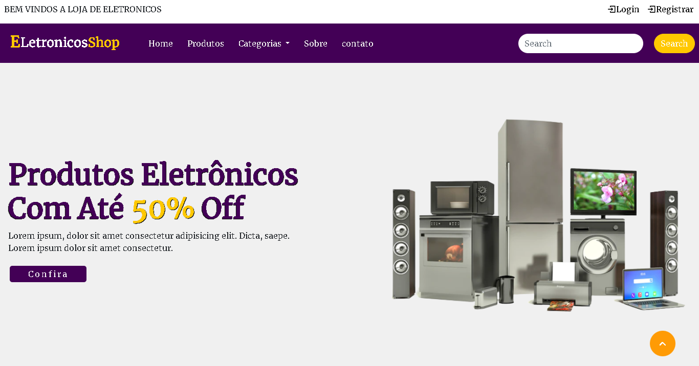

<h1>
 

      <h1> E-commerce
         
   
<h1>

# Visão Geral:
Projeto desenvolvido na faculdade, do curso de Análise e desenvolvimento de Sistemas, orientado pelo professor Anderson.  

# Tecnologias Utilizadas:
 .Visual Studio Code;   
 .Front-end: HTML, CSS e JS.  
 .Bootstrap. 
 

